# 🌸 Nulli Bot

> A Discord-native AI chatbot that blends seamlessly into voice chats — no awkward bots allowed.

<p align="center">
  
</p>

---

## ✨ Project Overview

**Developers:** Quan Pham, Adrian Munoz, Daniel Nguyen

**Nulli Artist:** Aendri

Nulli is an AI-powered Discord bot built for natural, real-time voice interactions. Designed for seamless integration into Discord voice calls, Nulli can speak, listen, and even ~~learn~~ over time. Designed with personality in mind (just think Hatsune Miku x Faker with a pinch of gremlin energy), Nulli feels like just another user in the chat!

---

## 🚀 Features

- 🎙️ Joins and leaves Discord voice channels
- 💬 Everything is processed locally for faster interference
  - Able to be run on a T4 GPU on Google Colab
- 📝 Transcribes audio from multiple users at once using OpenAI Whisper
- 🌸 Prompt engineering using concise, delicately crafted prompts to keep Nulli's personality consistent
- 📜 Iteratively resummarizes the conversation between responses to manage context size
- 🦙 Uses Ollama llama3 models as the core LLM
- 🔊 Responds via voice chat using TTS by Kokoro
- 🧠 Built with LangChain and LangGraph  

---

## Flowchart

```mermaid
graph TD
    NULLI[🌸 Nulli]
    VC[🎙️ Discord Voice Channel]
    DECIDE_TO_SPEAK[🤔 Decide to speak]
    AUDIO@{ shape: docs, label: "🔊 Audio Files per User" }
    SST[📝 Whisper Speech-to-Text]
    NULLI_REGEX[✏️ Nulli name mispronunciation correction]
    LLM[🧠 LLAMA LLM]
    TTS[🗣️ Kokoro Text-to-Speech]
    NOISE_SUPPRESSION[🤫 DeepFilterNet Noise Suppression]
    ITERATIVE_SUMMARY[📜 Iteractive Summary]
    RESPONSE[🧙‍♂️ Response]
    TOXIC_REGEX_FILTER[😤 Toxic Regex Filter]
    TOXIC_LLM_FILTER[🦾 Llama-guard LLM Filter]


    NULLI-->VC
    VC--Listening on AudioSink and SilenceGeneratorSink-->AUDIO
    AUDIO--prepend silence to normalize-->NOISE_SUPPRESSION
    AUDIO-->DECIDE_TO_SPEAK
    DECIDE_TO_SPEAK-->AUDIO
    NOISE_SUPPRESSION-->SST
    SST-->NULLI_REGEX
    NULLI_REGEX--sort transcription chunks and combine for all users-->LLM
    LLM--recent audio transcription (context)-->ITERATIVE_SUMMARY
    ITERATIVE_SUMMARY-->LLM
    LLM-->RESPONSE
    RESPONSE-->TOXIC_REGEX_FILTER
    TOXIC_REGEX_FILTER-->TTS
    TOXIC_REGEX_FILTER-->TOXIC_LLM_FILTER
    TOXIC_LLM_FILTER-..-xTTS
    TTS-->DECIDE_TO_SPEAK
```



## Challenges and Considerations

At the core of our design principles is faster inference time (~5 seconds from transcription -> speech response), which is both a blessing and a curse. We evaluated inference times on a Google Colab T4 GPU. Much of our challenges comes from GPU hardware limitations.

### Scope and Model Selection

- On one hand, scope is reduced due to prioritizing core features of Nulli's pipeline while discarding others. For example, after evaluating inference times with a RAG architecture for memory retrieval, we decided to drop the memory feature due to long retrieval times (even ~2 seconds is a huge hit to the pipeline) and settled with the iterative summary feature.
- On the other hand, we have had to selectively choose our models to fit within Google Colab's T4 GPU with 16 GB of vRAM. Here are some tradeoffs:
  - Core LLM - Chose llama3.2:3b-instruct-q4_K_M (2 GB) over llama3.1:8b-instruct-q4_K_S (4.7 GB).
    - With more parameters, there is generally a higher increase in quality. However, we found that having a concise, carefully crafted prompt keeps the quality reduction in check, especially for keeping a consistent personality.
  - Filter LLM - Chose llama-guard3:1b (1.6 GB) over llama-guard3:8b (4.9 GB)
    - We combined the llama-guard3:1b model with regex filtering against a list of bad words. Additionally, the core LLM can also refuse to respond to the user. The last safe-guard check using the llama-guard model acts as a soft check against Nulli's final output. Thus, we have multiple filter barriers to ensure Nulli's personality is not **too** gremlin.

### Tool Calling and Deciding When to Speak

- Tool calling was considered for various aspects of our pipeline. For example, a tool call to "decide when to speak" and a tool call to "retrieve memory or search the web via DuckDuckGo" were considered. However, tool calling was inconsistent (ex. need to retrieve memory for information about Nulli's lore but the tool call did not trigger) and took a hit at inference time since it was another LLM call.
  - Currently, Nulli listens for a 5 second buffer period where no one talks before starting the response pipeline. We find this to be sufficient as a minimum viable product to test whether Nulli can handle responding to a group conversation while recalling the current conversation events. The downside is that Nulli does not have the ability to **not** respond. This can be solved with a fine-tuned tool calling LLM for "deciding when to speak" or more complex state logic to detect if Nulli was addressed for a question or people are not talking for a long time.

### Parallelizing the Pipeline

We found areas in our pipeline that would be useful to be parallelize. Therefore, our current longest link for inference is the pipeline from transcription to core LLM call. Therefore, the summarization and llama-guard3 LLM calls, which are required, do not severely affect the inference time.

- When the conversation is transcribed, we found it useful to parallelize the core LLM response call along with the iterative summarization call.
- When the text response is finished, we run both the Kokoro TTS and llama-guard3 in parallel, providing a callback to stop playing speech audio if the llama-guard3 detects if the response is unsafe.

### Finetuning the Core LLM

- We attempted to finetune the core LLM (experiments found in ./src/finetune/finetune.ipynb) to tailor Nulli's response to be shorter and closer to her personality. However, with limited data (100 examples), we found the finetuned model's outputs became less coherent (ex. incomplete outputs). We decided that the current unfinetuned LLM was sufficient for our minimum viable product.

### Whisper: Real-time or Batch Processing?

- After experimenting with using Whisper audio transcription in real-time vs via batch processing, we have decided it is much faster, less GPU intensive, and better quality to do batch processing.
  - With real-time processing, our pipeline starts to slow down and we start losing audio packets quickly since our threaded code cannot keep up with each Whisper transcription. Additionally, Whisper will hallucinate more since we are sending shorter audio which may be mostly silent, affecting the quality of the input to the core LLM.
  - With batch processing, Whisper is more likely to not hallucinate since the audio files are longer and are expected to have coherent audio. Additionally, with significantly less Whisper calls, our voice channel connection loop is faster and is able to respond to Discord's connection heartbeat in time.

## Future Works

To build beyond our minimum viable product, we have identified several key features to enhance the quality of Nulli's experience:

### Keeping Inference Fast and Low-cost / Model Finetuning

- We would still want to run our models locally in order to protect user privacy as well as controlling costs on our end.
  - Given better GPU hardware and more data for Nulli's responses, we can finetune each model to perform their tasks better.
    - Finetune Core LLM call to tailor the responses to be more consistent with personality and response length
    - Finetune Whisper model to identify the word "Nulli" and stop hallucinating on silences better.
- We would detail the cost modeling and pricing for Nulli's full pipeline.

### Learning Capabilitiies

- We have experimented with the Qdrant vectorstore for RAG capabilities. Given the proper GPU hardware, we would hope to integrate memory retrieval into Nulli's pipeline.
  - Additionally, a hybrid approach with a knowledge graph would give better results since we know some of the relations in our information. For example, storing "user1" -- friends --> "user2" or "user1" -- likes --> "league of legends" counters bad queries and irrelevant information to the Qdrant vectorstore.

## 💾 Developer Setup

### 📦 Requirements

> **Python:** 3.11.0rc2  
> Be sure to configure your environment variables and dependencies as shown below.

#### 🔧 Core Dependencies

```bash
pip install python-dotenv
pip install discord.py[voice]
```

#### 🧠 LLM + RAG Stack

```bash
pip install langchain langgraph langsmith langchain-community
pip install langchain_ollama
pip install langchain-qdrant fastembed
pip install duckduckgo-search
```

#### 🗣️ Speech-To-Text

> Download [ffmpeg](https://www.gyan.dev/ffmpeg/builds/) and add it to your PATH.

```bash
pip install SpeechRecognition
pip install torch torchvision torchaudio --index-url https://download.pytorch.org/whl/cu121
pip install --upgrade transformers optimum accelerate
pip install git+https://github.com/imayhaveborkedit/discord-ext-voice-recv
pip install pydub
pip install deepfilternet
```

#### 🗨️ Text-To-Speech

> Download [rubberband](https://breakfastquay.com/rubberband/) and add it to your PATH.

```bash
pip install -q "kokoro>=0.9.4" soundfile
pip install pyrubberband
pip install misaki[ja]      # could cause an error with visual studio build? 
python -m unidic download
```

#### 🦥 Finetuning (Unsloth)

> Follow the setup at [Unsloth Docs](https://docs.unsloth.ai/get-started/installing-+-updating)

```bash
pip install "unsloth[windows] @ git+https://github.com/unslothai/unsloth.git"
```

---

### ⚙️ Environment Configuration

Create a `.env` file in `src/`:

```env
DISCORD_BOT_TOKEN=your_token
LANGSMITH_TRACING=true
LANGSMITH_ENDPOINT=your_endpoint
LANGSMITH_API_KEY=your_api_key
LANGSMITH_PROJECT=your_project_name
PROJECT_ROOT=/absolute/path/to/src
```

---

## 🖥️ Running Locally

### 🦙 Start Ollama

Run Ollama on multiple ports to reduce cold starts:

```bash
# Terminal 1
OLLAMA_HOST=localhost:11434 OLLAMA_NUM_PARALLEL=2 OLLAMA_KEEP_ALIVE=-1 OLLAMA_FLASH_ATTENTION=1 ollama serve

# Terminal 2
OLLAMA_HOST=localhost:11435 OLLAMA_KEEP_ALIVE=-1 OLLAMA_FLASH_ATTENTION=1 ollama serve

# Terminal 3
# Not needed for now. Memory not integrated due to inference speed.
# OLLAMA_HOST=localhost:11436 OLLAMA_KEEP_ALIVE=-1 OLLAMA_FLASH_ATTENTION=1 ollama serve
```

## ☁️ Running on Google Colab

We have provided an Jupyter notebook export at ./Nulli_bot_Colab_Export_(public).ipynb that you can put into Google Colab.

### 🌸 Start Nulli

Make sure you've invited Nulli to your Discord server. Then, from `src/`:

```bash
python nulli.py
```

---

## 💬 Supported Discord Commands

| Command | Description |
| - | - |
| `$join` | Joins the current voice channel and starts the conversational loop |
| `$leave` | Leaves the current voice channel |

---
